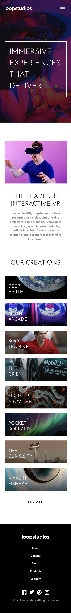

# Loopstudios landing page solution

This is a solution to the [Loopstudios landing page challenge on Frontend Mentor](https://www.frontendmentor.io/challenges/loopstudios-landing-page-N88J5Onjw). Frontend Mentor challenges help you improve your coding skills by building realistic projects.

## Table of contents

- [Overview](#overview)
  - [The challenge](#the-challenge)
  - [Screenshot](#screenshot)
  - [Links](#links)
- [My process](#my-process)
  - [Built with](#built-with)
  - [What I learned](#what-i-learned)

## Overview

### The challenge

Users should be able to:

- View the optimal layout for the site depending on their device's screen size
- See hover states for all interactive elements on the page

### Screenshot

### Links

- Solution URL: [Github Repo](https://github.com/shobhit-gupta/fem11-loopstudios)
- Live Site URL: [https://fem11-loopstudios.vercel.app](https://fem11-loopstudios.vercel.app)

## My process

### Built with

- [Svelte](https://svelte.dev/) - Frontend Framework (like React)
- [SvelteKit](https://kit.svelte.dev/) - Fullstack Framework (like Next.js)
- [tailwindcss](https://tailwindcss.com/) - Utility-first CSS framework

### What I learned

- Reallife like dev environment. First Sveltekit + tailwindcss + Vercel project developed with
  - Agile approach
  - Multiple environments from the start
  - Develop then refactor style coding for almost every incremental change.
- CSS only Hamburger menu with tailwindcss
- Reuse of same Navigation HTML component on 3 instances with different styles
- Underline animation with tailwindcss
- Revisited z-index fundamentals
- `whitespace-pre` class
